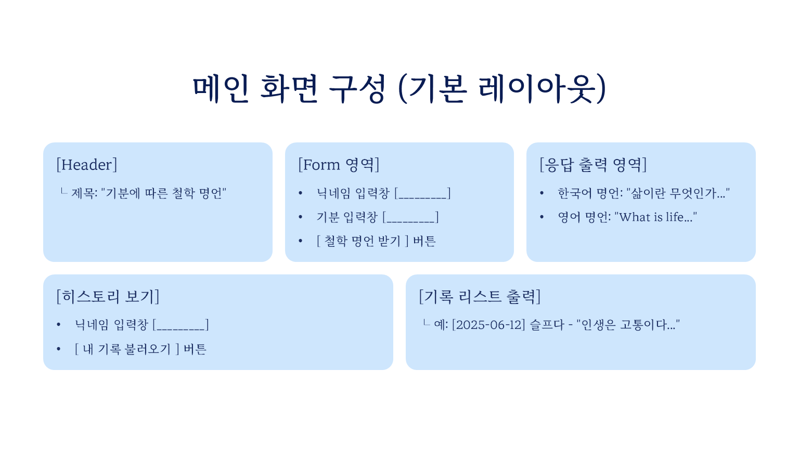

# 기분에 따른 철학 명언 추천 웹앱

## 주제
기분에 맞는 철학 명언을 추천해주는 챗봇형 웹앱 개발

---

## 사용 기술 스택

| 구성 요소   | 사용 기술                              |
|------------|------------------------------------------|
| 프론트엔드 | HTML, CSS, JavaScript (fetch, DOM 조작) |
| 백엔드     | Python, FastAPI, httpx                   |
| 데이터 저장 | JSON 파일 기반 저장 방식                 |
| 기타       | 로컬 서버 환경(CORS, 비동기 처리 등)     |

---

## 구현 기능 요약

| 기능       | 설명                                                    |
|------------|----------------------------------------------------------|
| 명언 생성   | 기분 입력 후 GPT가 한국어/영어 명언 반환                    |
| 명언 저장   | 닉네임, 날짜, 기분, 명언 내용을 JSON에 저장                 |
| 채팅 복원   | localStorage에 저장된 채팅을 새로고침 시 복원                 |
| 사용자 구분 | 로그인 없이 닉네임 기준으로 데이터 구분                     |
| GPT 연동   | Weniv API 연동 방식 사용                                 |
| UX 개선     | 로딩 표시 등 기본 인터랙션 개선                           |

---

## 주요 기능 흐름

1. 사용자가 닉네임과 기분 입력  
2. GPT API 요청 → 철학 명언 반환  
3. 결과를 화면에 출력하고 닉네임 기준으로 저장  
4. 저장된 채팅은 새로고침 시 localStorage로 복원 가능  

---

## 와이어프레임



---

## 작업 일정 체크리스트 (WBS)

### Day 1
- 레포지토리 생성 및 주제 확정  
- FastAPI 기본 세팅 (가상환경, CORS)  
- HTML/CSS 초기 레이아웃 구성  
- API 엔드포인트 및 스키마 설계  
- 와이어프레임 제작  

### Day 2
- ChatGPT API 연동  
- 채팅 UI 구성 (입력창, 버튼, 출력 영역)  
- 메시지 전송 기능 구현 (fetch POST)  
- 비동기 처리 및 에러 핸들링  
- CSS 적용 및 로딩 상태 표시  

### Day 3
- 채팅 기록 저장 및 불러오기 기능 구현  
- 새로고침 시 기록 복원 처리  
- 비로그인 상태에서 기능 제한 구현  
- README 정리 및 시연 영상 제작  
- 최종 파일 제출  

---

## 어려웠던 점과 해결 과정

### 로그인 기능 구현 중 반복되는 오류

- 세션 기반 로그인 중 오탈자, 괄호 누락 등 오류 빈발  
- JWT 방식까지 구현이 복잡해 닉네임 기반 인증으로 전환  

**→ 해결:** 닉네임만 입력해도 데이터 저장이 가능하도록 구조 변경

---

### 포트 충돌 문제

- FastAPI 서버가 열려 있어도 브라우저에서 연결되지 않음  
- 원인은 포트 점유 중인 이전 프로세스  
- 포트 번호를 `8010`으로 변경하여 해결

---

### 자동 새로고침 문제

- `submit` 기본 동작으로 인해 응답 결과 사라짐  

**해결 방법**
- `event.preventDefault()` 사용  
- 백엔드에서 `asyncio.sleep()`으로 출력 지연 처리  
- *그러나 저장도 지연되며 근본 해결은 아님*

---

### GPT 응답 형식 오류로 인한 출력 문제

- 긴 문장 입력 시 줄바꿈 없이 출력 포맷이 깨지는 문제 발생  

**해결 방법**
- 백엔드 프롬프트에 `"첫 줄은 한국어, 두 번째 줄은 영어로"` 명시  
- 프론트 JS에서 줄바꿈 기준으로 명언 구분 후 출력

---

## 느낀 점

- GPT를 활용하면 빠르게 MVP는 구현 가능  
- 그러나 실제 오류 해결은 사용자의 구조 이해와 디버깅 능력에 달림  
- GPT는 도우미일 뿐, 진짜 개발자는 **직접 문제를 해결할 수 있어야 한다**

---

## 핵심 코드 요약 (`main.py` 중)

```python
@gpt_router.post("/save-quote")
def save_quote(nickname: str, mood: str):
    messages = [
        {"role": "system", "content": "assistant는 감정에 맞는 철학자 명언을 한국어와 영어로 제공하는 지혜로운 철학자다."},
        {"role": "user", "content": f"오늘 나는 '{mood}' 기분이야. 철학 명언을 **첫 줄은 한국어, 두 번째 줄은 영어로** 알려줘."}
    ]
    response = requests.post("https://dev.wenivops.co.kr/services/openai-api", json=messages)
    quote = response.json()["choices"][0]["message"]["content"]

    data = {
        "nickname": nickname,
        "mood": mood,
        "quote": quote,
        "date": datetime.now().strftime("%Y-%m-%d")
    }

    try:
        with open("history.json", "r", encoding="utf-8") as f:
            history = json.load(f)
    except:
        history = []

    history.append(data)
    with open("history.json", "w", encoding="utf-8") as f:
        json.dump(history, f, ensure_ascii=False, indent=2)

    return {"message": "저장 완료!", "data": data}
